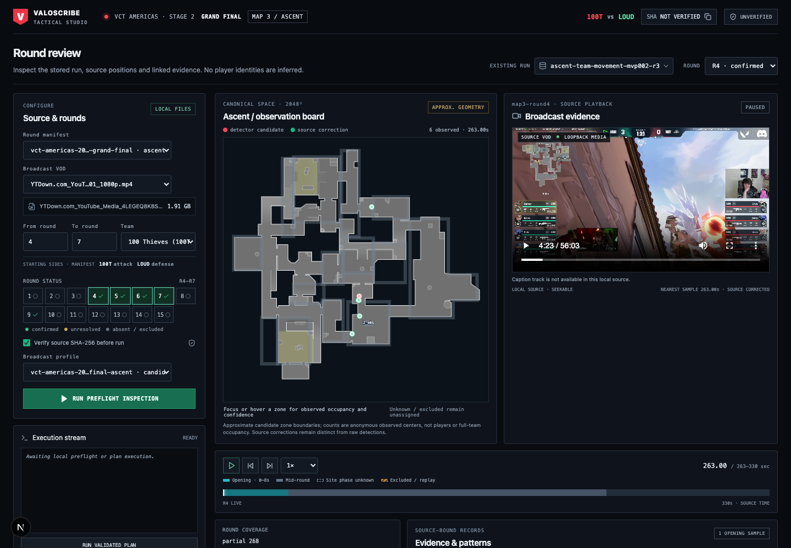
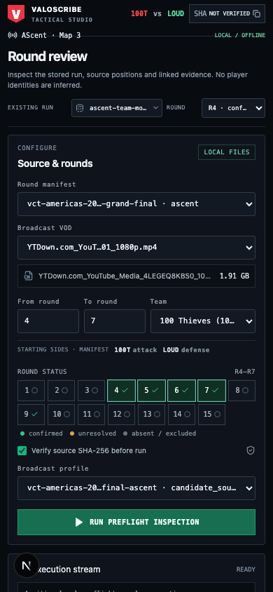
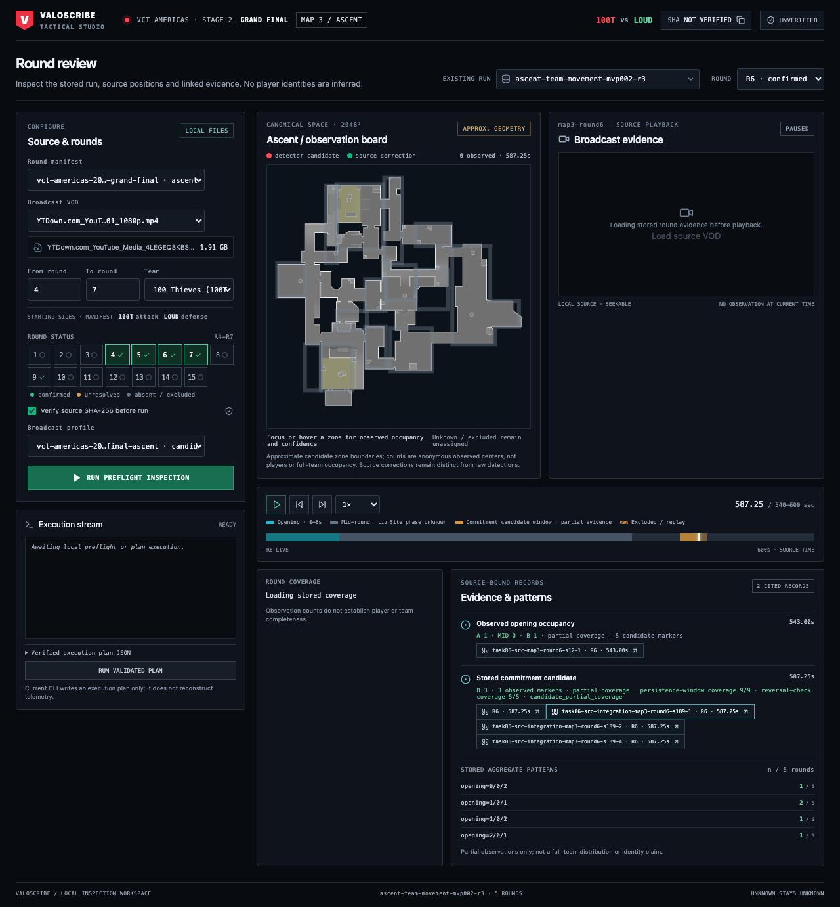
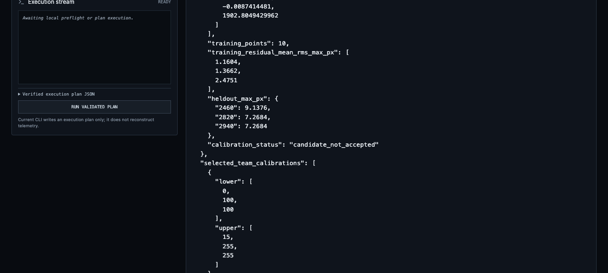

# Valoscribe web studio

The loopback-only Next.js app is an offline inspection and preflight interface for the local Ascent VCT Americas Map 3 source. Its user-facing artifact is a synchronized source-VOD time cursor, anonymous canonical-map observations, recorded coverage, and direct timestamped evidence links beside the real local manifest/preflight controls.

## Start and use

1. From this repository, run `cd web && npm install && npm run dev` (or `cd valoscribe/web` when starting at the workspace root). The dev server binds to `127.0.0.1:3000`; it is not a remote service. Use Node.js 24 and a working local `uv` installation for Python preflight/job routes.
2. Choose the actual round manifest, source VOD, team and a contiguous confirmed round range. The 15-cell matrix labels confirmed, unresolved, excluded and missing rounds in text and color. The VOD file size comes from local filesystem metadata.
3. Run **Run preflight inspection**. Python remains the authority for manifest/range/SHA validation. The header digest is copyable only after successful validation. A failed request is shown inline and in the execution log; change the source/range and retry.
4. Choose an existing run and one of its available rounds. Run metadata is matched to a local manifest by source SHA and all stored round IDs before interval/timeline labels are shown; the source VOD is matched to the run's stored source identifier. If that linkage cannot be proven, phase timing is withheld.
5. Hover/focus or activate a zone to inspect its count of anonymous observed marker centers and mean confidence at the nearest sample. Round evidence loads before source playback; click **Load source VOD** to opt into video fetching. Selecting a cited evidence identifier then seeks the VOD to its stored timestamp. Use the phase timeline, playback-rate menu, or quarter-second step buttons.
6. **Run validated plan** streams the local CLI output via SSE. The current CLI writes an `execution-plan.json` only; it does not reconstruct positions. On SSE completion the run list refreshes and selects the new artifact. The selected plan displays its stored configuration with an explicit no-telemetry/no-positions notice.

## Components

- `Header.tsx` — match/map identification, 100T–LOUD context, verified SHA copy control, preflight state.
- `PreflightConfig.tsx` — local manifest/VOD/profile choices, file size, round/team/starting-side config, textual status matrix, SHA option, inline failure state.
- `ExecutionTerminal.tsx` — live SSE log, verified execution-plan JSON, and plan-only capability disclaimer.
- `TacticalRadar.tsx` — real canonical Ascent raster and YAML-derived candidate polygons; source-synchronized anonymous markers; keyboard-accessible zone counts/confidence.
- `VideoDeck.tsx` — local source VOD with native seek/audio controls and time synchronization.
- `RoundTimeline.tsx` — source-time scrubber, 0.25-second step buttons, speed selection, 0–8-second opening band, mid-round band and actual excluded/replay spans. Site phase remains explicitly unknown because this source has no supported site-phase interval.
- `TacticalEventsFeed.tsx` — stored aggregate opening, shift, regroup and commitment samples, patterns and exact source evidence IDs; citations seek the real timestamp. Absent events are not asserted.

The primary page composes those components and gates run timing to a manifest whose source digest and round IDs agree with the selected run. No generated position, identity, team-side marker, tactical claim or completeness statistic is added.

## Local API use

- `GET /api/manifests` lists example manifests/profiles, approved local VOD metadata and the configured Ascent zones.
- `POST /api/preflight` sends the current VOD, map, match, map ID, rounds, team, profile, manifest, unique run output directory and SHA setting to the existing Python CLI. Python validation is fail-closed.
- `POST /api/jobs/run` re-preflights and streams status/log/complete/error events. `complete` explicitly says `reconstruction: false` and identifies the plan artifact.
- `GET /api/runs` discovers telemetry runs from `manifest.json`, plan-only runs from valid `execution-plan.json`, and configuration-only directories from valid `config.snapshot.yaml`. Telemetry manifests take precedence. Plan-only and config-only records are explicitly typed and never receive fabricated observations or tactical claims. `GET /api/runs/[runId]` returns the plan-only artifact without telemetry; telemetry detail returns raw and append-only-correction-replayed observations, stored coverage/adjudications/reviewed frames, aggregate evidence and actual local map config.
- `GET|HEAD /api/media/[...path]` serves approved local MP4/PNG assets and byte ranges for playback/seek. Open-ended range replies are capped at 8 MiB to avoid transferring the remaining multi-gigabyte VOD on metadata requests. The UI does not fetch the video until playback is requested, so paused media cannot starve run-detail requests.

API mutation routes are same-origin loopback-only. VOD, manifest/profile, and output locations remain restricted by the existing backend. Never expose this development server to a network.

## Real-source captures

Captured from the actual local 1,905,859,456-byte VCT broadcast and `ascent-team-movement-mvp002-r3`, Round 4. These captures show the current implementation, not synthetic data.

At desktop width, controls remain in one narrow operations rail; the canonical Ascent floorplan and synchronized broadcast are adjacent, with phase timeline and cited partial opening sample beneath. Six anonymous observed centers appear at the sample time. Team identities are not painted onto the radar.

At phone width the forms, map, video, timeline and evidence stack into one column; selecting data does not require sideways page scrolling. The status matrix uses compact multi-column cells while each round retains a text label.

The final production build shows R6 coverage `partial 235 · unknown 5`. Selecting the stored 587.25s citation synchronizes the paused video and timeline, with three anonymous observed centers in B Main (mean confidence 69%). Stored persistence/reversal windows are candidate evidence, not a verified site phase.

A generated execution plan is selectable after SSE completion. Its round selector is disabled and no radar, video or tactical claims are attached to the configuration-only artifact.

## Evidence and limitations

- Verified local VOD SHA-256: `a2feb25b842b6c1c2baa17f8ef0c5ecfe1816bd058a1c256350fa95900454c44`; confirmed manifest rounds include 4–7 and 9. Round 9 has an explicit 971–975s replay/transition exclusion.
- Selected run MVP002 R3 has five included rounds; immutable raw detections, append-only source corrections, partial sample coverage and stored source-cited openings are displayed from its actual records. Markers carry no `team_id`; no player identities or full-frame approval are inferred.
- Approximate manually authored Ascent zones are review candidates, not official map geometry or quantitatively calibrated boundaries. Unknown/outside points remain unassigned.
- The current `analyze-vod --no-preflight` path writes a plan only, not telemetry. Plan-only output directories are selectable and inspectable, clearly separated from telemetry runs. Stored aggregate opening/shift/regroup/commitment events render only when present with their source-supported observation citations. Commitment persistence and reversal-check windows appear on the timeline only for stored commitment records and remain labeled as partial candidate evidence; the site-phase interval remains unknown.
- This broadcast does not provide a caption sidecar in the local media API; the UI does not invent captions/transcript. Source VOD caption accessibility remains a limitation.
- Browser verification covered 1440×1000 desktop and 390×844 mobile. Source seeking and the media endpoint's 206 byte-range response were verified locally. Desktop browser screen readers/keyboard navigation should remain part of analyst acceptance.

## Checks

From `web/`: `npm run build`, `npm run lint`, and `npm test`. The source Python package is unchanged. Parent-verified repository checks: `uv run --extra parquet --extra dev pytest` (1,282 passed, 1 skipped), `uv run --extra parquet --extra dev ruff check src tests`, `uv run --extra parquet --extra dev mypy src/valoscribe` (136 files clean).
