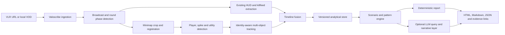

> **Archived:** Historical material retained for provenance; it is not current implementation guidance. Use the [active MVP Reset specification](../active/MVP_RESET_AND_REPOSITORY_CLEANUP_SPEC.md).

# VALORANT Pro-Gameplay Tactical Movement Analyzer

## AI-Agent Implementation Specification

**Working repository name:** `valorant-tactical-analyzer`  
**Recommended implementation base:** Fork of `SphinxNumberNine/valoscribe`  
**Document version:** 0.1  
**Status:** Implementation-ready MVP specification  
**Date:** 29 September 2026  

---

## 1. Purpose of this document

This document is the source of truth for an AI coding agent implementing an offline system that analyzes professional VALORANT broadcast VODs and reconstructs how a team moves around a map under specific round scenarios.

The system must combine:

- Existing Valoscribe HUD extraction and round-state logic.
- Minimap crop detection and normalization.
- Player, spike, and utility detection.
- Multi-object tracking and identity assignment.
- Timeline fusion across HUD, killfeed, minimap, and round events.
- Scenario-based tactical analysis.
- Evidence-backed natural-language reports.
- An optional LLM provider layer that can later use OpenAI, Gemini through its OpenAI-compatible endpoint, or another OpenAI-compatible API.

The first implementation must not depend on an LLM API. Computer vision, tracking, event reconstruction, scenario filtering, and evidence generation must work deterministically without an API key.

### Normative language

- **MUST** means required for the relevant milestone.
- **SHOULD** means strongly recommended unless a documented reason prevents it.
- **MAY** means optional.

---

## 2. Product summary

### 2.1 Problem

A coach or analyst can watch many professional rounds and recognize patterns such as defaults, site pressure, rotations, lurks, executes, retakes, and utility triggers. Doing this manually across dozens of VODs is slow, inconsistent, and difficult to search.

The proposed system converts broadcast video into structured, queryable evidence. It should answer questions such as:

- How does Team X open attack rounds on Ascent?
- What happens after the team establishes B Main and Mid control but has not committed by 1:05?
- Who normally anchors the opposite side during a four-player regroup?
- How quickly do defenders rotate after first contact at A?
- Which utility events commonly precede a site entry?
- How does the team respond after losing or winning the opening duel?
- What post-plant positions and retake paths recur?

### 2.2 Product outcome

For a selected team, map, side, and scenario, the system produces:

1. A structured list of matching rounds.
2. Reconstructed player and spike trajectories.
3. Utility events with time, location, source, and confidence.
4. Round-phase and movement-pattern labels.
5. Aggregate statistics and representative examples.
6. A tactical summary whose claims link to exact rounds and timestamps.
7. Debug evidence for low-confidence detections.

### 2.3 Core principle

> The LLM explains structured evidence; it does not invent the evidence.

Raw coordinates, identities, utility events, kills, spike state, and round state must be produced by deterministic code or explicit machine-learning models with confidence scores. An LLM may translate a user question into filters and summarize selected evidence, but it must not be the primary frame-by-frame detector.

---

## 3. MVP scope

### 3.1 In scope

The MVP MUST support:

- Professional spectator-broadcast VODs at 1920×1080.
- One known broadcast HUD layout.
- One map initially: **Ascent**.
- One complete map VOD or a local map segment.
- Team and player metadata supplied by Valoscribe/VLR metadata or a local metadata file.
- Existing Valoscribe round, player HUD, killfeed, score, timer, side, spike-plant, and ability-inventory extraction where available.
- Minimap crop extraction.
- Canonical minimap registration.
- Attack/defense and team-color resolution per half and overtime state.
- Detection of all visible player icons.
- Player identity assignment using team composition and temporal continuity.
- Player movement tracks with normalized coordinates and named zones.
- Spike carrier/location state when detectable.
- A first utility subset, beginning with persistent, spatially visible utility such as smokes.
- Round timeline fusion.
- Scenario filtering.
- Deterministic tactical summaries and evidence references.
- JSONL, Parquet, and human-readable HTML or Markdown output.
- Local CLI execution.
- A disabled-by-default OpenAI-compatible LLM adapter.

### 3.2 Explicitly out of scope for the first MVP

The MVP MUST NOT attempt to support:

- Live in-game guidance or a real-time overlay.
- Player POV streams that do not expose all ten players on the spectator HUD/minimap.
- Every map and every tournament HUD.
- Every ability or exact ability activation semantics.
- Automatic support for arbitrary resolutions.
- Reliable weapon/economy inference beyond what Valoscribe already extracts.
- Prediction of the next play during a live match.
- Automated recommendations that claim a team “should” make a particular decision.
- A multi-tenant SaaS platform.
- Mobile applications.
- Automatic model training without a reviewed dataset and evaluation split.

### 3.3 Later extensions

After the MVP is validated, later milestones MAY add:

- All current maps.
- Multiple HUD profiles and automatic layout detection.
- Utility-specific detectors.
- Learned icon detection.
- Unsupervised round clustering.
- A browser-based review and correction interface.
- Team-versus-team comparisons.
- Batch tournament ingestion.
- GPU acceleration.
- Native OpenAI Responses API and native Gemini adapters in addition to the common compatibility adapter.

---

## 4. Existing foundation: Valoscribe

The implementation should fork and extend Valoscribe rather than recreating its existing functionality.

At the time this specification was prepared, Valoscribe:

- Uses Python 3.10+.
- Uses OpenCV, NumPy, Pydantic, Typer, Tesseract, Pillow, yt-dlp, BeautifulSoup, Requests, and Playwright.
- Processes professional VALORANT spectator VODs.
- Extracts match and round events, kills, abilities, ultimates, spike plants, score, timer, player state, and metadata.
- Uses a phase state machine and tournament-specific HUD coordinate configuration.
- Produces JSONL event logs and CSV frame states.
- Is published under the MIT License.

### 4.1 Fork strategy

The implementation agent MUST:

1. Create a fork of `SphinxNumberNine/valoscribe`.
2. Preserve the existing MIT license and copyright notice.
3. Add the upstream repository as a Git remote.
4. Run the existing test suite before changing production code.
5. Record the upstream commit SHA used as the baseline.
6. Avoid renaming the Python package during the MVP.
7. Add functionality behind new modules and explicit CLI flags rather than performing a broad rewrite.
8. Preserve existing output files unless a migration is documented.

Suggested setup:

```bash
gh repo fork SphinxNumberNine/valoscribe --clone --remote
cd valoscribe
uv sync --dev
uv run pytest
uv run ruff check src tests
uv run mypy src/valoscribe
```

If GitHub CLI is unavailable, use a normal fork and clone workflow. The exact command is less important than preserving an `upstream` remote and a clean baseline.

### 4.2 Extension policy

New implementation should be placed under these logical modules:

```text
src/valoscribe/
├── minimap/          # crop, registration, detection, tracking, zones
├── fusion/           # combine HUD, killfeed, minimap and round state
├── analytics/        # scenarios, patterns, aggregates, evidence
├── storage/          # Parquet/JSONL/run manifest and query helpers
├── llm/              # disabled-by-default provider abstraction
├── reporting/        # deterministic and optional LLM narratives
└── review/           # debug overlays and later manual correction support
```

Existing modules should be reused where possible, especially:

- Video reading and VOD download.
- HUD crop configuration.
- Round phase detection.
- Game state management.
- Player metadata.
- Event collection.
- Existing Pydantic types.

---

## 5. Users and primary workflows

### 5.1 Target users

- VALORANT coaches.
- Team analysts.
- Strategy creators.
- Esports researchers.
- Players performing retrospective VOD study.

### 5.2 Workflow A: process one map

1. User supplies a VLR match URL or local video and metadata.
2. Valoscribe downloads or opens the map VOD.
3. Existing HUD analysis reconstructs round state.
4. The minimap pipeline detects and tracks players, spike, and supported utility.
5. Timeline fusion produces one coherent per-round state stream.
6. The analytics stage indexes scenarios and patterns.
7. The report stage creates an HTML/Markdown report and machine-readable files.
8. The user opens representative rounds at exact timestamps.

### 5.3 Workflow B: ask a tactical question

Example:

> “On Ascent attack, what does this team do when it has B Main and Mid control at 1:05 with all ten players alive?”

The system should:

1. Convert the question into a validated `ScenarioQuery`.
2. Select rounds using structured fields.
3. Compute movement, timing, and utility aggregates.
4. Choose representative and outlier rounds.
5. Generate an evidence-backed summary.
6. Return exact match, map, round, and VOD timestamps.

Without an LLM key, the same workflow must be available through CLI filters or a JSON query file.

### 5.4 Workflow C: inspect uncertainty

The system should expose:

- Low-confidence detections.
- Missing player samples.
- Identity switches.
- Registration failures.
- Replay/overlay exclusions.
- Utility events inferred from more than one source.

A user should be able to view a debug image or short interval that explains why an item is uncertain.

---

## 6. Functional requirements

| ID | Requirement | MVP priority |
|---|---|---|
| FR-001 | Ingest a local video or use the existing Valoscribe VLR/YouTube path. | Must |
| FR-002 | Preserve existing Valoscribe HUD and event outputs. | Must |
| FR-003 | Read minimap crop coordinates from a versioned HUD profile. | Must |
| FR-004 | Normalize the minimap against a canonical map image. | Must |
| FR-005 | Resolve actual team, broadcast slot/color, and attack/defense side independently. | Must |
| FR-006 | Detect visible player icons and output confidence and source frame. | Must |
| FR-007 | Assign detections to player identities and maintain tracks through brief misses. | Must |
| FR-008 | Convert track points into normalized coordinates and named zones. | Must |
| FR-009 | Track spike carrier/location/state when evidence is available. | Must |
| FR-010 | Detect an initial set of persistent spatial utility. | Must |
| FR-011 | Fuse minimap data with round, killfeed, player HUD, timer, and ability events. | Must |
| FR-012 | Detect and exclude replay, pause, desk, and obscured intervals. | Must |
| FR-013 | Emit versioned Parquet/JSONL schemas and a run manifest. | Must |
| FR-014 | Query rounds by map, side, time, alive count, zones, spike, utility, and opening outcome. | Must |
| FR-015 | Label common round phases and formations using deterministic rules. | Must |
| FR-016 | Generate evidence-backed deterministic reports. | Must |
| FR-017 | Provide representative rounds and direct timestamp references for every report section. | Must |
| FR-018 | Produce debug overlays showing crops, detections, identities, tracks, zones, and confidence. | Must |
| FR-019 | Support optional natural-language query parsing through an OpenAI-compatible provider. | Should |
| FR-020 | Support optional LLM summarization of already-computed evidence. | Should |
| FR-021 | Allow later manual correction without rewriting raw detections. | Should |
| FR-022 | Process multiple maps in a batch. | Later |
| FR-023 | Cluster tactically similar rounds. | Later |
| FR-024 | Provide a browser review UI. | Later |

---

## 7. Non-functional requirements

### 7.1 Reproducibility

Every processing run MUST record:

- Run ID.
- Source VOD identifier and local file hash.
- Upstream Valoscribe commit.
- Project commit.
- HUD profile version.
- Map asset and zone-config version.
- Detector and tracker versions.
- Model hashes, if learned models are introduced.
- Sampling rates.
- CLI arguments.
- Environment/package lock hash.
- Start/end time and stage durations.

### 7.2 Testability

- Core algorithms MUST be callable without CLI or network access.
- Unit tests MUST use small local fixtures.
- Integration tests MUST not require API keys.
- LLM tests MUST use a fake provider.
- Golden-output tests MUST compare semantic content, not unstable timestamps or absolute paths.

### 7.3 Explainability

Each derived event or report claim MUST retain evidence references. An evidence reference should include:

- Match/map/round ID.
- VOD timestamp.
- Round-relative time.
- Source type.
- Confidence.
- Optional frame path or debug artifact.

### 7.4 Robustness

The pipeline MUST fail gracefully when:

- The minimap is temporarily hidden.
- A replay is shown.
- A scoreboard or production overlay covers the minimap.
- One or more icons overlap.
- Team colors change between maps.
- A HUD profile does not match.
- A map asset changes after a patch.
- Metadata is incomplete.

Failures should lower confidence or mark an interval unusable, not silently fabricate data.

### 7.5 Performance

Initial development should favor correctness over speed. The MVP SHOULD:

- Process an average professional map on a modern 8-core CPU in no more than approximately 60 minutes after optimization.
- Stream frames rather than loading full videos into memory.
- Keep peak memory below 8 GB for one active worker.
- Support stage-level caching so analytics can be rerun without repeating computer vision.

These are targets, not reasons to compromise accuracy. The baseline must be benchmarked before optimization.

### 7.6 Security

- API keys MUST only be read from environment variables or a local secret manager.
- `.env` MUST be ignored by Git.
- Logs MUST redact keys and authorization headers.
- Raw VOD upload to an external model MUST be disabled by default.
- Tests MUST never make accidental external API calls.
- User-controlled paths and URLs MUST be validated.

---

## 8. High-level architecture



### 8.1 Processing stages

1. **Ingestion** — locate or download the map segment and metadata.
2. **Broadcast-state detection** — determine live round, replay, pause, desk, or obscured state.
3. **HUD extraction** — reuse Valoscribe outputs.
4. **Minimap extraction** — crop, register, mask, and normalize.
5. **Object detection** — find player icons, spike, and supported utility.
6. **Tracking** — assign identities and smooth trajectories.
7. **Fusion** — reconcile all sources into a coherent round timeline.
8. **Storage** — write immutable raw/derived layers.
9. **Analytics** — derive zones, phases, formations, transitions, and scenario matches.
10. **Reporting** — create statistics, representative rounds, and evidence-backed narratives.

---

## 9. Sampling strategy

The implementation must support separate sampling rates by stage.

Recommended defaults:

```text
HUD_SAMPLE_FPS=4
MINIMAP_SAMPLE_FPS=8
EVENT_WINDOW_FPS=12
REPORT_PREVIEW_FPS=2
```

- Existing Valoscribe HUD analysis may remain at 4 FPS initially.
- Player movement should start at 8 FPS during active rounds.
- Event windows MAY be reprocessed at 12 FPS around kills, plants, and suspected rapid utility use.
- Sampling MUST use exact VOD timestamps rather than assuming a stable frame rate.
- All stages MUST share one monotonic timestamp convention.

---

## 10. Minimap pipeline design

### 10.1 HUD profile extension

Each HUD profile MUST define a minimap crop rectangle and any broadcast-specific masks.

Example:

```json
{
  "profile_id": "vct_champs_2025_1080p_v1",
  "frame_width": 1920,
  "frame_height": 1080,
  "minimap": {
    "x": 24,
    "y": 24,
    "width": 310,
    "height": 310,
    "mask_polygons": [],
    "expected_orientation": "fixed",
    "team_color_mode": "broadcast_slots"
  }
}
```

Coordinates above are illustrative; the implementation agent must derive and validate the actual values from a fixture.

### 10.2 Canonical map coordinate system

Each map uses normalized coordinates:

```text
Top-left     = (0.0, 0.0)
Bottom-right = (1.0, 1.0)
```

All detections must be transformed from crop pixels to canonical map coordinates.

A map configuration MUST include:

- Map name and stable ID.
- Canonical minimap image.
- Image version/patch metadata.
- Walkable-area mask.
- Site polygons.
- Spawn polygons.
- Named zone polygons.
- Optional lane/chokepoint graph.
- Orientation rules.
- Registration thresholds.

### 10.3 Registration approach

Implement registration in increasing complexity:

1. Fixed crop and scale using the HUD profile.
2. Static background template matching.
3. Edge-based alignment or OpenCV ECC refinement.
4. Optional affine transform if production scaling/translation varies.
5. Homography only if evidence shows a true perspective distortion.

Registration output MUST include:

- Transformation matrix.
- Registration confidence.
- Reprojection/alignment error.
- Failure reason when rejected.

### 10.4 Player candidate detection

The first detector SHOULD use constrained computer vision before a learned detector:

1. Subtract or compare against the registered empty-map background.
2. Use broadcast team-color masks to find dynamic icon candidates.
3. Apply contour, shape, and size filtering.
4. Crop the agent portrait region.
5. Match the portrait against the known five-agent composition for that team.
6. Emit all viable candidates with confidence rather than only the top candidate.

The detector MUST keep these concepts separate:

```text
actual_team
broadcast_slot
broadcast_color
current_side
player_id
agent_id
```

No code may assume that “red” always means attack or that “blue” always means defense.

### 10.5 Identity assignment and tracking

Use a deterministic baseline:

- One track per known player.
- Constant-velocity Kalman filter or equivalent state estimator.
- Hungarian assignment between predicted tracks and detections.
- Gating by distance, plausible movement speed, team, and candidate agent.
- Temporal continuity penalty for identity changes.
- Team-composition constraint: each of the five player identities appears at most once per timestamp.
- Short-gap interpolation only when confidence and elapsed time are within configured bounds.

Recommended association cost:

```text
cost =
    w_position * normalized_distance
  + w_agent * agent_mismatch_penalty
  + w_color * color_mismatch_penalty
  + w_identity * identity_switch_penalty
  + w_motion * velocity_inconsistency_penalty
```

The tracker MUST emit identity-switch diagnostics and retain raw detections separately from corrected tracks.

### 10.6 Spike tracking

Spike state should be fused from:

- Existing HUD spike status.
- Carrier marker on the minimap, where visible.
- Spike drop marker.
- Plant events.
- Planted spike location.

Allowed states:

```text
UNKNOWN
IN_SPAWN
CARRIED
DROPPED
PLANTING
PLANTED
DEFUSING
DEFUSED
DETONATED
ROUND_ENDED
```

### 10.7 Utility detection

Utility detection must be incremental and ability-specific.

First implementation order:

1. Persistent circular smoke regions.
2. Persistent wall/line utility.
3. Recon/suppression markers.
4. Traps, cameras, and deployables visible on the minimap.
5. Brief area-denial effects.

Every utility event MUST record:

- Ability and agent, if known.
- Team and player, if known.
- Appeared/activated/deactivated/expired/destroyed event.
- Center point or geometry.
- Start and end timestamps.
- Evidence sources.
- Confidence.
- Whether the event is observed or inferred.

HUD inventory changes and minimap appearance should be fused. For example, a charge disappearing from an initiator’s HUD followed by a matching minimap marker may identify both the user and location.

### 10.8 Replay and obstruction handling

No minimap data should enter the analytical timeline unless the broadcast-state detector considers the interval live.

The detector should use combinations of:

- Existing phase state.
- Timer continuity.
- Score continuity.
- Replay graphics or known overlay templates.
- Sudden repeated historical event sequences.
- Minimap/HUD visibility checks.
- Frame-level confidence.

Rejected intervals MUST be logged with a reason.

---

## 11. Timeline fusion

### 11.1 Source hierarchy

Different sources have different strengths. Suggested precedence:

| State or event | Primary source | Secondary source |
|---|---|---|
| Round boundaries | Valoscribe phase/score state | Timer and score continuity |
| Player alive/dead | Player HUD and killfeed | Icon disappearance with caution |
| Player position | Minimap tracker | None |
| Team/side | Metadata plus half/round state | HUD color/config |
| Spike plant | Valoscribe event | Minimap spike state |
| Ability charge used | Player HUD | Killfeed/main-frame cues |
| Spatial utility location | Minimap | Main-frame detector |
| Kill/trade | Killfeed | Player HUD state |

### 11.2 Fusion rules

- Never overwrite a high-confidence explicit event with a weaker inference.
- Conflicting evidence MUST be retained in diagnostics.
- Interpolation MUST not cross death, teleport, round boundary, replay, or long missing intervals.
- All derived events MUST declare their evidence sources.
- The timeline MUST distinguish VOD time, round elapsed time, and displayed round clock.

### 11.3 Round-state output

The fused state should support snapshots at a configurable interval, recommended at 0.25 or 0.5 seconds.

```json
{
  "match_id": "...",
  "map_id": "...",
  "round_id": "...",
  "vod_timestamp_s": 341.25,
  "round_elapsed_s": 28.5,
  "display_clock_s": 71.5,
  "phase": "DEFAULT",
  "attacking_team": "Team Alpha",
  "defending_team": "Team Beta",
  "alive_attack": 5,
  "alive_defense": 5,
  "spike_state": "CARRIED",
  "players": [],
  "active_utility": [],
  "confidence": 0.94
}
```

---

## 12. Core data contracts

Use Pydantic models and version every persistent schema.

### 12.1 Recommended enums and models

```python
from enum import Enum
from typing import Literal
from pydantic import BaseModel, Field


class Side(str, Enum):
    ATTACK = "attack"
    DEFENSE = "defense"
    UNKNOWN = "unknown"


class EvidenceSource(str, Enum):
    MINIMAP = "minimap"
    PLAYER_HUD = "player_hud"
    KILLFEED = "killfeed"
    ROUND_STATE = "round_state"
    METADATA = "metadata"
    MAIN_FRAME = "main_frame"
    INFERENCE = "inference"


class NormalizedPoint(BaseModel):
    x: float = Field(ge=0.0, le=1.0)
    y: float = Field(ge=0.0, le=1.0)


class EvidenceRef(BaseModel):
    match_id: str
    map_id: str
    round_id: str
    vod_timestamp_s: float = Field(ge=0.0)
    round_elapsed_s: float | None = Field(default=None, ge=0.0)
    source: EvidenceSource
    confidence: float = Field(ge=0.0, le=1.0)
    frame_path: str | None = None
    note: str | None = None


class PlayerDetection(BaseModel):
    schema_version: Literal["1.0"] = "1.0"
    vod_timestamp_s: float
    team_id: str
    broadcast_slot: Literal["left", "right", "unknown"]
    broadcast_color: str | None = None
    side: Side
    candidate_player_ids: list[str]
    candidate_agent_ids: list[str]
    crop_point: NormalizedPoint
    canonical_point: NormalizedPoint
    detector_confidence: float = Field(ge=0.0, le=1.0)
    registration_confidence: float = Field(ge=0.0, le=1.0)
    source_frame: int | None = None


class PlayerTrackPoint(BaseModel):
    schema_version: Literal["1.0"] = "1.0"
    match_id: str
    map_id: str
    round_id: str
    vod_timestamp_s: float
    round_elapsed_s: float
    player_id: str
    agent_id: str
    team_id: str
    side: Side
    position: NormalizedPoint
    zone_id: str | None = None
    alive: bool
    observed: bool
    interpolated: bool = False
    confidence: float = Field(ge=0.0, le=1.0)
    evidence: list[EvidenceRef]


class UtilityEvent(BaseModel):
    schema_version: Literal["1.0"] = "1.0"
    match_id: str
    map_id: str
    round_id: str
    vod_timestamp_s: float
    player_id: str | None = None
    agent_id: str | None = None
    team_id: str
    ability_id: str
    event_type: str
    center: NormalizedPoint | None = None
    geometry: dict | None = None
    observed: bool
    confidence: float = Field(ge=0.0, le=1.0)
    evidence: list[EvidenceRef]
```

The agent may split these models into smaller files, but persistent field names must not change silently.

### 12.2 Scenario query

```python
class ScenarioQuery(BaseModel):
    map_ids: list[str] = []
    team_ids: list[str] = []
    sides: list[Side] = []
    round_numbers: list[int] = []
    buy_classes: list[str] = []
    min_display_clock_s: float | None = None
    max_display_clock_s: float | None = None
    alive_attack: int | None = None
    alive_defense: int | None = None
    required_control_zones: list[str] = []
    excluded_control_zones: list[str] = []
    spike_states: list[str] = []
    opening_duel_outcomes: list[str] = []
    required_utility_ids: list[str] = []
    phases: list[str] = []
    confidence_floor: float = 0.75
```

Use `Field(default_factory=list)` in production code rather than mutable defaults; the abbreviated example above is for readability.

### 12.3 Pattern summary

A pattern summary MUST contain structured values before narrative text:

```text
pattern_id
scenario_query
sample_size
matching_round_ids
representative_round_ids
outlier_round_ids
zone_occupancy_over_time
common_transition_sequences
rotation_timing_distribution
utility_timing_distribution
formation_distribution
outcome_distribution
confidence_summary
evidence_refs
narrative
```

---

## 13. Storage and run layout

Use immutable, layered outputs so a later analytics or LLM change does not require reprocessing video.

```text
runs/<run_id>/
├── manifest.json
├── input/
│   ├── metadata.json
│   └── source.json
├── baseline/
│   ├── event_log.jsonl
│   └── frame_states.csv
├── minimap/
│   ├── detections.parquet
│   ├── registration.parquet
│   ├── player_tracks.parquet
│   ├── spike_states.parquet
│   └── utility_events.parquet
├── fused/
│   ├── round_snapshots.parquet
│   ├── zone_transitions.parquet
│   └── scenario_segments.parquet
├── analytics/
│   ├── pattern_summaries.jsonl
│   ├── round_features.parquet
│   └── aggregates.duckdb
├── reports/
│   ├── report.md
│   ├── report.html
│   └── query_results/
└── debug/
    ├── overlays/
    ├── rejected_intervals/
    └── low_confidence/
```

### 13.1 Storage rules

- Raw detections MUST never be overwritten by tracker corrections.
- Derived tables MUST include `schema_version` and `run_id`.
- All timestamps MUST be numeric seconds with documented origin.
- Parquet is preferred for analytical tables.
- JSONL is preferred for appendable events and human debugging.
- DuckDB MAY be used as a query layer over Parquet.
- SQLite/PostgreSQL should not be introduced until an application server requires transactional state.

---

## 14. Map and zone configuration

### 14.1 Suggested file layout

```text
configs/maps/ascent/
├── map.yaml
├── canonical_minimap.png
├── walkable_mask.png
├── zones.geojson
├── sites.geojson
├── spawns.geojson
└── calibration/
    ├── reference_frames.json
    └── expected_points.json
```

### 14.2 Example map configuration

```yaml
schema_version: "1.0"
map_id: ascent
map_name: Ascent
asset_version: "2026-09"
canonical_width: 1024
canonical_height: 1024
orientation: fixed
registration:
  method: ecc_affine
  min_confidence: 0.85
  max_alignment_error_px: 6.0
tracking:
  max_gap_seconds: 1.25
  max_normalized_speed_per_second: 0.20
  identity_switch_penalty: 0.75
zones_file: zones.geojson
sites_file: sites.geojson
spawns_file: spawns.geojson
walkable_mask: walkable_mask.png
```

Exact thresholds must be established from fixtures and moved to configuration rather than hardcoded.

---

## 15. Scenario and tactical ontology

### 15.1 Round phases

The deterministic phase engine SHOULD support:

```text
PREROUND
OPENING
DEFAULT
PRESSURE
CONTACT
REGROUP
ROTATE
EXECUTE
POST_PLANT
RETAKE
SAVE
CLUTCH
ROUND_END
UNKNOWN
```

A round may contain multiple ordered segments. Phase labels must be derived from explicit rules, not only generated by an LLM.

### 15.2 Formation labels

Initial formation labels:

```text
FIVE_MAN_GROUP
FOUR_ONE_LURK
THREE_TWO_SPLIT
TWO_ONE_TWO_DEFAULT
THREE_ONE_ONE_DEFAULT
SITE_STACK
SPREAD_DEFAULT
UNKNOWN_FORMATION
```

Formation rules should use zone occupancy, pairwise distances, occupied lanes, and spike location.

### 15.3 Movement events

Recommended events:

```text
PLAYER_ENTERED_ZONE
PLAYER_LEFT_ZONE
TEAM_GAINED_ZONE_CONTROL
TEAM_LOST_ZONE_CONTROL
FIRST_CONTACT
FIRST_KILL
TRADE
SITE_ENTRY
SITE_COMMIT
ROTATION_STARTED
ROTATION_COMPLETED
REGROUP_STARTED
REGROUP_COMPLETED
LURK_ACTIVATED
SPIKE_CHANGED_CARRIER
SPIKE_DROPPED
SPIKE_PLANTED
RETAKE_STARTED
SAVE_STARTED
```

### 15.4 Zone control heuristic

For the MVP, “control” should be an explicit heuristic, not presented as ground truth.

A basic zone-control rule MAY require:

- At least one alive player in the zone or a configured adjacent support zone.
- No recent opposing presence within a time window, or an explicit contested state.
- Optional utility influence.
- Minimum confidence over a continuous duration.

Allowed state:

```text
ATTACK_CONTROL
DEFENSE_CONTROL
CONTESTED
UNKNOWN
```

### 15.5 Pattern extraction

Implement in two layers.

**Layer 1 — deterministic aggregation**

- Exact scenario filtering.
- Formation counts.
- Zone occupancy over normalized round time.
- Zone-transition sequences.
- Rotation start/completion distributions.
- Site-entry timing.
- Utility-to-entry delay.
- Opening-duel response.
- Spike path.

**Layer 2 — later similarity clustering**

- One-second or half-second round feature vectors.
- Dynamic time warping for zone-occupancy sequences.
- Trajectory similarity.
- Utility-event sequence similarity.
- HDBSCAN or k-medoids.
- Human-readable cluster naming after validation.

Clustering is not required before deterministic scenario reports work.

---

## 16. Evidence-backed reporting

### 16.1 Report sections

The MVP report SHOULD include:

1. Processing quality summary.
2. Map and side sample sizes.
3. Opening setups.
4. Default formations.
5. Early pressure locations.
6. Common regroup and rotation paths.
7. Site-entry timing and composition.
8. Lurk behavior.
9. Utility timing and locations for supported abilities.
10. Post-plant or retake positions.
11. Response to opening-kill win/loss.
12. Representative rounds.
13. Outliers and low-confidence caveats.

### 16.2 Claim requirements

Every tactical claim MUST include:

- Sample size.
- Selection criteria.
- At least one evidence reference.
- Confidence/caveat when source data is incomplete.

Bad:

> “The team always rotates through spawn.”

Good:

> “In 6 of 8 matching Ascent attack rounds, at least three players regrouped through attacker spawn after early B pressure. Representative examples: Rounds 4, 9, and 18.”

### 16.3 Deterministic narrative

A non-LLM template renderer MUST generate useful prose from structured aggregates. This guarantees that reports remain available without API credentials.

---

## 17. Optional LLM architecture

### 17.1 Role of the LLM

The LLM MAY perform only these tasks in the initial integration:

- Parse a natural-language tactical question into a validated `ScenarioQuery`.
- Select a presentation structure from precomputed analytics.
- Summarize structured aggregates.
- Explain representative and outlier rounds.
- Produce a report while preserving evidence references.

It MUST NOT:

- Invent coordinates or events.
- Decide player identity from raw video as the primary method.
- Claim an ability was used when no structured evidence exists.
- omit evidence references.
- Send a full VOD to an external API by default.

### 17.2 Provider abstraction

Use an internal protocol rather than binding business logic to one SDK endpoint.

```python
from typing import Protocol, TypeVar, type
from pydantic import BaseModel

T = TypeVar("T", bound=BaseModel)


class StructuredLLM(Protocol):
    def generate_structured(
        self,
        *,
        system_prompt: str,
        user_prompt: str,
        response_model: type[T],
    ) -> T: ...
```

Recommended implementations:

```text
FakeLLMProvider             # tests and offline development
OpenAICompatibleProvider   # common chat-completions-compatible subset
OpenAINativeProvider       # optional later adapter
GeminiNativeProvider       # optional later adapter
```

### 17.3 Environment contract

Create `.env.example` with:

```dotenv
LLM_ENABLED=false
LLM_PROVIDER=openai_compatible
LLM_API_KEY=
LLM_BASE_URL=
LLM_MODEL=
LLM_TIMEOUT_SECONDS=60
LLM_MAX_RETRIES=2
LLM_TEMPERATURE=0.1
LLM_ALLOW_IMAGE_UPLOAD=false
LLM_LOG_USAGE=true
```

For OpenAI, `LLM_BASE_URL` may be left at the adapter default. For Gemini’s OpenAI-compatible endpoint, the base URL can be configured without changing application code. Do not hardcode current model names; they must remain environment/configuration values.

### 17.4 Compatibility contract

The common adapter should use only a conservative subset:

- System and user messages.
- JSON-schema or structured response where supported.
- Function/tool calling only when covered by contract tests.
- Explicit timeout and retry behavior.
- Usage metadata when returned.

If the provider returns invalid JSON:

1. Validate with Pydantic.
2. Retry once with validation errors and no additional evidence.
3. Fail closed and fall back to deterministic query/report functionality.

### 17.5 Prompt safety and grounding

Prompts MUST state:

- Use only supplied facts.
- Do not infer missing events.
- Cite evidence IDs after every tactical claim.
- Distinguish observed, inferred, and unknown data.
- State sample size.
- Return the specified schema only.

The application must verify that every evidence ID in the LLM output exists in the supplied context.

---

## 18. Recommended repository structure

```text
valoscribe/
├── AGENTS.md
├── PROJECT_SPEC.md
├── FIRST_AGENT_PROMPT.md
├── .env.example
├── configs/
│   ├── hud/
│   └── maps/
│       └── ascent/
├── docs/
│   ├── adr/
│   ├── data-contracts/
│   └── evaluation/
├── src/valoscribe/
│   ├── minimap/
│   │   ├── cropper.py
│   │   ├── registration.py
│   │   ├── player_detector.py
│   │   ├── spike_detector.py
│   │   ├── utility_detector.py
│   │   ├── tracker.py
│   │   ├── zones.py
│   │   ├── config.py
│   │   └── types.py
│   ├── fusion/
│   │   ├── timeline_fuser.py
│   │   ├── replay_filter.py
│   │   └── confidence.py
│   ├── analytics/
│   │   ├── scenario_query.py
│   │   ├── phase_labeler.py
│   │   ├── formation_labeler.py
│   │   ├── pattern_engine.py
│   │   └── evidence.py
│   ├── storage/
│   │   ├── run_manifest.py
│   │   ├── parquet_store.py
│   │   └── duckdb_queries.py
│   ├── reporting/
│   │   ├── deterministic.py
│   │   ├── html.py
│   │   └── models.py
│   └── llm/
│       ├── base.py
│       ├── fake.py
│       ├── openai_compatible.py
│       ├── prompts.py
│       └── validation.py
└── tests/
    ├── fixtures/
    │   ├── frames/
    │   ├── short_clips/
    │   └── golden/
    ├── unit/
    ├── integration/
    ├── contract/
    └── evaluation/
```

The agent should adapt this structure to the existing repository rather than duplicating an existing module with a slightly different name.

---

## 19. CLI design

### 19.1 Process a VOD with minimap analysis

```bash
valoscribe orchestrate process \
  --video-path ./vods/map.mp4 \
  --metadata-path ./metadata.json \
  --hud-config ./configs/hud/vct_champs_2025_1080p.json \
  --output-dir ./runs/example \
  --sample-rate 4 \
  --enable-minimap \
  --map-config ./configs/maps/ascent/map.yaml \
  --minimap-sample-rate 8
```

### 19.2 Calibrate/debug the minimap

```bash
valoscribe minimap calibrate \
  --video ./vods/map.mp4 \
  --timestamp 00:21:14.500 \
  --hud-config ./configs/hud/vct_champs_2025_1080p.json \
  --map-config ./configs/maps/ascent/map.yaml \
  --output ./debug/calibration
```

Expected output:

- Raw frame.
- Minimap crop.
- Registered minimap.
- Alignment overlay.
- Candidate player icons.
- JSON diagnostics.

### 19.3 Build analytics

```bash
valoscribe analytics build --run-dir ./runs/example
```

### 19.4 Query without an LLM

```bash
valoscribe analytics query \
  --run-dir ./runs/example \
  --team "Team Alpha" \
  --map ascent \
  --side attack \
  --clock-min 60 \
  --clock-max 75 \
  --alive 5v5 \
  --require-zone b_main \
  --require-zone mid
```

### 19.5 Query with an optional LLM

```bash
LLM_ENABLED=true valoscribe query \
  --run-dir ./runs/example \
  "What does Team Alpha do from B Main and Mid control at around 1:05 in 5v5 rounds?"
```

---

## 20. Milestones and implementation backlog

The AI agent should implement one issue at a time in the order below. It may combine only tightly coupled tasks and must preserve reviewable changes.

### Milestone 0 — Fork, baseline, and contracts

#### VTA-001 — Establish fork baseline

**Tasks**

- Record upstream commit SHA.
- Install dependencies.
- Run existing tests, linting, and type checks.
- Record failures without changing behavior.
- Add `PROJECT_SPEC.md`, `AGENTS.md`, and `docs/adr/0001-minimap-extension.md`.

**Acceptance**

- Baseline commands and results are documented.
- No production behavior changes.
- Existing license is preserved.

#### VTA-002 — Add run manifest

**Tasks**

- Implement a Pydantic `RunManifest`.
- Record source, commits, configs, arguments, versions, and timings.
- Write manifest atomically.

**Acceptance**

- A test run emits `manifest.json`.
- Unit tests validate serialization and required fields.

#### VTA-003 — Define persistent schemas

**Tasks**

- Add player detection, track, utility, evidence, and scenario models.
- Add schema-version fields.
- Document compatibility policy.

**Acceptance**

- Models validate good fixtures and reject invalid coordinates/confidence.
- JSON schema can be generated.

#### VTA-004 — Add fixture and golden-test conventions

**Tasks**

- Add small legally usable local frame/clip fixtures or scripts that create synthetic fixtures.
- Define expected-output directories.
- Add fixture provenance notes.

**Acceptance**

- Tests run offline.
- Fixtures are small enough for normal Git or documented LFS use.

### Milestone 1 — Minimap crop and registration

#### VTA-101 — Extend HUD profile with minimap crop

**Tasks**

- Add backward-compatible minimap config fields.
- Validate frame dimensions.
- Implement crop extraction.

**Acceptance**

- Existing profiles without minimap config still load.
- Golden crop test passes.

#### VTA-102 — Create Ascent map configuration

**Tasks**

- Add canonical minimap asset reference.
- Add normalized zone/site/spawn polygons.
- Add asset version and provenance.

**Acceptance**

- Config validates.
- A zone lookup test maps known points correctly.

#### VTA-103 — Implement minimap registration

**Tasks**

- Implement fixed transform and ECC/affine refinement.
- Return matrix, confidence, and error.
- Reject bad registration.

**Acceptance**

- Labeled reference frames meet the configured alignment threshold.
- Failures produce diagnostics, not exceptions that terminate the map.

#### VTA-104 — Add calibration CLI and visual overlays

**Acceptance**

- One command writes raw crop, registered crop, overlay, and JSON diagnostics.

### Milestone 2 — Player icon detection

#### VTA-201 — Build team-color candidate detector

**Tasks**

- Implement configurable color-space masks.
- Find and filter contours.
- Emit multiple candidates and confidence.

**Acceptance**

- Precision/recall is measured on a labeled frame set.
- Debug overlays show accepted/rejected candidates.

#### VTA-202 — Add agent-portrait candidate matching

**Tasks**

- Reuse known team compositions from metadata.
- Compare icon-center crops against attack/defense templates.
- Return ranked candidates.

**Acceptance**

- Mirror compositions do not break team-side assignment.
- Unit tests cover ambiguous portraits.

#### VTA-203 — Resolve team, side, color, and half state

**Acceptance**

- Tests cover first half, second half, and overtime side changes.
- No hardcoded red/blue-to-side assumption exists.

### Milestone 3 — Tracking and identity

#### VTA-301 — Implement track state and motion model

- One track per known player.
- Predict position during short missing intervals.
- Enforce plausible movement gates.

#### VTA-302 — Implement constrained Hungarian assignment

- Use position, portrait candidate, team, and continuity costs.
- Record assignment confidence and alternate candidates.

#### VTA-303 — Add smoothing and safe interpolation

- Never interpolate across deaths, rounds, teleports, replays, or long gaps.

#### VTA-304 — Write player tracks and diagnostic metrics

**Acceptance for Milestone 3**

- `player_tracks.parquet` is produced.
- Labeled rounds report identity accuracy, visible-player coverage, and identity switches.
- Debug playback displays stable identities.

### Milestone 4 — Fusion, zones, and round events

#### VTA-401 — Map track points to zones

- Point-in-polygon lookup.
- Hysteresis near boundaries.
- Emit enter/leave events.

#### VTA-402 — Fuse alive state and kills

- Stop dead-player tracks.
- Handle resurrection only if game rules/agent state explicitly support it.

#### VTA-403 — Add replay and obstruction filtering

- Mark live, replay, pause, hidden, and unknown intervals.

#### VTA-404 — Produce fused round snapshots

**Acceptance for Milestone 4**

- Each active round has a coherent, timestamped player-state sequence.
- Replays do not duplicate round events.
- Zone-transition output is queryable.

### Milestone 5 — Spike and initial utility

#### VTA-501 — Spike-state fusion

- Combine HUD and minimap evidence.
- Track carrier changes, drop, plant, and planted location.

#### VTA-502 — Persistent smoke detector

- Detect appearance, location, duration, overlap, and disappearance.
- Start with a limited supported-agent list.

#### VTA-503 — Fuse HUD ability usage with spatial utility

- Associate a charge change with a nearby utility appearance within a time window.
- Mark uncertain association as inferred.

**Acceptance for Milestone 5**

- Supported smoke events have precision/recall and timing-error metrics.
- Each event contains evidence and confidence.

### Milestone 6 — Scenario analytics and deterministic reporting

#### VTA-601 — Implement `ScenarioQuery`

- CLI/JSON query input.
- Validated filters.
- Matching round/segment output.

#### VTA-602 — Implement deterministic phase labels

- Opening, default, pressure, regroup, rotate, execute, post-plant, retake, save.

#### VTA-603 — Implement formation labels

- Five-man, 4-1, 3-2, 2-1-2, spread, stack, unknown.

#### VTA-604 — Implement aggregates and representative-round selection

- Use medoid-like selection or closest-to-median structured features.
- Identify outliers separately.

#### VTA-605 — Generate deterministic Markdown/HTML report

**Acceptance for Milestone 6**

- A full Ascent map generates a readable report.
- Every tactical claim has sample size and evidence references.
- The report remains useful with `LLM_ENABLED=false`.

### Milestone 7 — Optional LLM integration

#### VTA-701 — Add provider abstraction and fake provider

- No SDK dependency in analytics domain code.
- Fake provider supports deterministic tests.

#### VTA-702 — Add OpenAI-compatible provider

- Configurable base URL, key, and model.
- Structured output validation.
- Timeout, retry, and usage logging.

#### VTA-703 — Natural-language to `ScenarioQuery`

- Validate all model output.
- Show parsed filters to the user.
- Fall back to deterministic CLI filters on failure.

#### VTA-704 — Evidence-grounded narrative generation

- Supply only selected structured aggregates and evidence IDs.
- Verify all returned evidence IDs.
- Reject unsupported claims.

**Acceptance for Milestone 7**

- OpenAI-compatible and fake-provider contract tests pass.
- No API call occurs when disabled.
- Invalid output fails closed.

### Milestone 8 — Review UI and scale, after MVP

- Interactive map playback.
- Manual identity/event corrections.
- Multi-map batch queues.
- Caching and parallel workers.
- Learned detector evaluation.
- Similarity clustering.

---

## 21. Testing strategy

### 21.1 Test layers

**Unit tests**

- Config validation.
- Coordinate transforms.
- Point-in-polygon zone lookup.
- Assignment cost and gating.
- Fusion precedence.
- Scenario filtering.
- Report evidence validation.

**Golden-frame tests**

- Crop coordinates.
- Registration output.
- Player candidates.
- Utility candidates.
- Debug overlay rendering.

**Golden-round tests**

- Identity continuity.
- Zone transitions.
- Alive-state handling.
- Replay exclusion.
- Spike timeline.

**Integration tests**

- Short clip through all deterministic stages.
- Full run directory layout.
- Cache reuse.
- CLI exit codes.

**Provider contract tests**

- Fake provider.
- Mock HTTP server for OpenAI-compatible schema.
- Malformed JSON.
- Timeout.
- Rate limit.
- Unknown evidence ID.

### 21.2 Evaluation split

Labeled data MUST be separated into:

- Development/training fixtures.
- Validation fixtures used during tuning.
- A held-out test set not used for threshold selection.

Do not report test metrics from frames used to design color masks or thresholds.

### 21.3 Initial metrics

| Component | Metric | Initial target |
|---|---|---|
| Minimap registration | Successful registered active frames | ≥ 98% on selected HUD/map fixture |
| Registration | Median alignment error | ≤ 4 px on labeled reference points |
| Player detection | Recall on visible, unobstructed icons | ≥ 95% |
| Player detection | Precision | ≥ 95% |
| Tracking | Visible player-seconds assigned correctly | ≥ 90% |
| Tracking | Identity switches | ≤ 1 per round on average |
| Side mapping | Correct team/side assignment | 100% on test set |
| Zone mapping | Correct named zone | ≥ 95% away from boundaries |
| Smoke detection | Precision and recall | ≥ 90% for supported smoke types |
| Event timing | Median smoke timing error | ≤ 0.5 s |
| Reporting | Claims with valid evidence IDs | 100% |
| Replay filtering | Duplicate replay events admitted | 0 on selected test maps |

Targets may be revised through an ADR after a measured baseline, but revisions must not hide regressions.

---

## 22. Observability and diagnostics

Each stage SHOULD emit structured logs with:

```text
run_id
match_id
map_id
round_id
stage
vod_timestamp_s
status
confidence
reason_code
duration_ms
```

Recommended metrics:

- Frames read/processed/skipped.
- Registration success rate.
- Detections per team per frame.
- Missing-player count.
- Assignment ambiguity.
- Identity switches.
- Interpolation duration.
- Rejected intervals by reason.
- Utility candidates and accepted events.
- Stage duration and cache hit rate.
- LLM request count, latency, token/usage metadata, and validation failures.

Do not log API keys, raw authorization headers, or unnecessarily large prompts.

---

## 23. Definition of Done

An issue is complete only when:

- Acceptance criteria are met.
- Production code has type annotations appropriate to the existing project.
- Unit tests cover expected and failure paths.
- Existing tests still pass, or an intentional migration is documented.
- Ruff and type checks pass at the repository’s configured level.
- CLI/help text and configuration examples are updated.
- Persistent schema changes are versioned.
- Debug artifacts are produced where relevant.
- The issue does not introduce an unguarded external API call.
- No secret is committed.
- The agent provides a concise implementation note with changed files, tests, and known limitations.

---

## 24. AI coding agent operating rules

The implementation agent MUST follow these rules:

1. Read the current repository before proposing a rewrite.
2. Implement only the active milestone/issue unless a dependency is unavoidable.
3. Prefer small, reviewable commits.
4. Preserve backward compatibility by default.
5. Do not change persistent field names without a schema-version migration.
6. Do not hardcode tournament coordinates outside a HUD profile.
7. Do not hardcode map thresholds outside a map/detector config.
8. Do not assume team color equals game side.
9. Do not use an LLM to replace a missing deterministic detector.
10. Do not add a network dependency to tests.
11. Do not add a large model before evaluating the simpler baseline.
12. Store raw detections and derived tracks separately.
13. Every inference must have confidence and evidence.
14. Add an ADR for major architectural decisions.
15. Stop and document the blocker when required fixture data is absent; implement synthetic/unit coverage where possible instead of inventing real coordinates.

### 24.1 Required agent response after each issue

The agent should report:

```text
Issue completed:
Files changed:
Behavior added:
Tests run and results:
Metrics, if applicable:
Known limitations:
Next issue:
```

---

## 25. First sprint

The first sprint should stop after a reliable minimap calibration pipeline. It should not attempt player tracking yet.

### Sprint objective

Given one 1080p Ascent VOD fixture and a HUD profile, produce a registered canonical minimap image and diagnostics at a requested timestamp.

### Sprint tasks

1. Complete VTA-001 through VTA-004.
2. Complete VTA-101 through VTA-104.
3. Add one Ascent map config.
4. Add at least five calibration frames from different rounds, halves, and overlay conditions.
5. Measure registration success/error.
6. Add a calibration CLI.
7. Document how to add another HUD profile and map.

### Sprint acceptance demo

```bash
valoscribe minimap calibrate \
  --video ./tests/fixtures/short_clips/ascent_sample.mp4 \
  --timestamp 00:00:08.500 \
  --hud-config ./configs/hud/test_1080p.json \
  --map-config ./configs/maps/ascent/map.yaml \
  --output ./tmp/calibration
```

The command must produce:

```text
frame.png
minimap_crop.png
registered_minimap.png
alignment_overlay.png
diagnostics.json
```

`diagnostics.json` must include transform, confidence, error, profile ID, map asset version, and pass/fail reason.

---

## 26. MVP acceptance criteria

The MVP is complete when one selected full Ascent professional map can be processed end to end and:

- Existing Valoscribe outputs remain available.
- Live rounds are separated from replays and interruptions.
- All ten players are tracked for most visible active-round time.
- Attack/defense and actual team identity are correct across side changes.
- Tracks are mapped to named zones.
- Spike path/state is represented when detectable.
- Supported smoke events are represented with time, location, duration, and confidence.
- Scenario queries return correct matching rounds.
- The deterministic report describes opening setups, formations, rotations, entries, and supported utility patterns.
- Every report claim links to source rounds/timestamps.
- Debug overlays make errors inspectable.
- The entire deterministic system works with no API key.
- An OpenAI-compatible adapter can be enabled later through environment variables without changing domain logic.

---

## 27. Risks and mitigations

| Risk | Impact | Mitigation |
|---|---|---|
| Broadcast HUD changes | Crops and templates fail | Versioned HUD profiles, calibration CLI, layout checks |
| Map art changes after a patch | Registration/zone drift | Versioned map assets and test frames |
| Overlapping player icons | Missed or swapped identities | Multi-candidate detector, motion continuity, composition constraints |
| Replays duplicate events | False tactical patterns | Broadcast-state gating and continuity checks |
| Utility semantics vary by agent | Incorrect timing/user | Ability-specific logic, observed/inferred distinction |
| VLR scraping changes | Ingestion failure | Adapter boundary and local metadata input |
| Insufficient labeled data | Unreliable thresholds | Small reviewed gold set before learned models |
| LLM hallucination | Unsupported tactical claim | Structured inputs, schema validation, evidence-ID verification |
| API cost/provider drift | Unstable product | LLM disabled by default, provider abstraction, deterministic fallback |
| CPU processing is slow | Poor usability | Profiling, caching, stage parallelism, optional GPU later |
| Policy/IP concerns | Distribution constraints | Offline retrospective design, preserve licenses, review Riot policy before public launch |

---

## 28. Compliance and product boundary

This project should remain a retrospective, post-match analysis tool. It should not become an in-game “go here now” overlay or live performance assistant.

Before a public or commercial launch, review Riot’s current developer policy, product registration requirements, data opt-in requirements, scouting restrictions, and use of official assets. VOD usage must also respect the rights and terms of the source platform and broadcast owner.

This specification is an engineering plan, not legal advice.

---

## 29. Decisions intentionally deferred

The following decisions should remain open until deterministic MVP results are available:

- OpenAI versus Gemini versus another OpenAI-compatible provider.
- Native Responses API versus compatibility endpoint as the default adapter.
- Learned object detector architecture.
- Database/server framework.
- Full web UI technology.
- Cloud provider and deployment architecture.
- Batch queue technology.
- Commercial packaging.

Deferring these decisions prevents infrastructure and API choices from blocking the core computer-vision validation.

---

## 30. References reviewed for this specification

1. Valoscribe repository and README: https://github.com/SphinxNumberNine/valoscribe
2. Valoscribe project dependencies: https://github.com/SphinxNumberNine/valoscribe/blob/main/pyproject.toml
3. Valoscribe MIT license: https://github.com/SphinxNumberNine/valoscribe/blob/main/LICENSE
4. Gemini OpenAI compatibility documentation: https://ai.google.dev/gemini-api/docs/openai
5. OpenAI API documentation: https://developers.openai.com/api/docs
6. Riot VALORANT developer policy and public content catalog: https://developer.riotgames.com/docs/valorant

---

# Appendix A — Example evidence-backed output

```json
{
  "scenario": {
    "map_ids": ["ascent"],
    "team_ids": ["team_alpha"],
    "sides": ["attack"],
    "min_display_clock_s": 60,
    "max_display_clock_s": 75,
    "alive_attack": 5,
    "alive_defense": 5,
    "required_control_zones": ["b_main", "mid_bottom"]
  },
  "sample_size": 8,
  "summary": {
    "most_common_next_transition": "regroup_through_attacker_spawn",
    "count": 6,
    "median_rotation_start_s": 69.4,
    "median_a_entry_s": 42.8
  },
  "representative_rounds": [
    {
      "round_id": "match17-map2-r04",
      "vod_timestamp_s": 814.2,
      "evidence_ids": ["ev-129", "ev-132", "ev-145"]
    }
  ],
  "narrative": "In 6 of 8 matching rounds, the team converted B Main and Mid presence into a three-or-more-player regroup through attacker spawn before an A-side entry. The sentinel or secondary lurker remained B-side in four of those six rounds."
}
```

# Appendix B — Initial ADRs

Create these decision records as implementation begins:

```text
0001-minimap-extension-of-valoscribe.md
0002-canonical-map-coordinate-system.md
0003-raw-detections-versus-derived-tracks.md
0004-evidence-and-confidence-model.md
0005-openai-compatible-provider-boundary.md
0006-parquet-and-duckdb-analytical-storage.md
```

# Appendix C — Suggested future UI

The future review UI should include:

- Video player synchronized with a canonical map.
- Ten colored player tracks with identity labels.
- Timeline of kills, utility, plant, phase changes, and confidence gaps.
- Filters for team, side, phase, score, economy, alive count, zones, and utility.
- Heatmaps and zone-transition graph.
- Representative round comparison.
- A correction mode that writes patches rather than altering raw data.
- A natural-language query box that displays the parsed structured query before execution.
